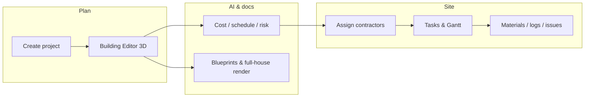

<p align="center">
  
</p>

<h1 align="center">BuildPlan AI</h1>
<p align="center">
  <strong>AI-Powered Smart Construction Planning Platform</strong><br/>
  One workspace from 3D design → estimates & schedule → site execution
</p>

<p align="center">
  <a href="https://github.com/Habimana06/AI-POWERED-SMART-CONSTRUCTION-PLANNING-PLATFORM">GitHub</a>
</p>

---

## About this project

**BuildPlan AI** is a full-stack web platform for construction teams who want planning, design, and field work in one place—not scattered spreadsheets and static PDFs.

The **3D building model** you save in the editor is the source of truth: the same geometry drives **floor plans**, **full-house exterior renders**, **AI cost and schedule insights**, and **contractor-facing project views**. The public **landing site** shows live platform stats, an auto-sliding gallery of real project renders, and testimonials that admins approve before they go live.

Built as a capstone-style system with **Admin**, **Project Manager**, and **Contractor** roles, email notifications, optional **SMS (Twilio)**, and **authenticator 2FA**.

---

## Platform flow



---

## Features by area

### Public website
- Hero carousel (`resources/hero/hero1–4.jpg`, login art)
- Live stats from the database (projects, budget in **FRw**, users, progress)
- Full-house image slider from saved project renders
- About page with **leadership pulled from real admin/PM profiles**
- Contact form + footer testimonial submissions → **Admin → Landing Inbox**

### Project Manager
- Create projects (manual or AI-assisted design path)
- **Building Editor** (React Three Fiber)—rooms, floors, materials
- **Design Output**: professional floor plan + full-house image (PDF/PPT export)
- AI assistant, cost estimation, Gantt scheduling, risk prediction
- Assign contractors and monitor progress

### Contractor
- Assigned projects with **read-only floor plan & full-house** (same output as PM)
- Tasks, material requests (with AI review notes), daily progress, issue reports
- Messages and notifications

### Admin
- Users, companies, all projects (detail includes design tab)
- Analytics, audit logs, platform settings
- Approve testimonials and reply to contact messages by email

### Shared
- Profile (job title, department—for leadership display), password, **2FA (TOTP)**, notification prefs (email/SMS)
- Forgot password via **6-digit email code**

---

## Tech stack

| Part | Stack |
|------|--------|
| UI | React 18, Vite, Tailwind CSS, Framer Motion, React Three Fiber, Recharts |
| API | Node.js, Express, JWT + refresh tokens, Socket.io |
| Database | MySQL 8 |
| AI | Groq (chat/planning); optional xAI / Gemini / Pollinations for images |
| Run | Docker Compose (MySQL + backend + Nginx frontend) |

---

## Get started

### Option A — Docker (easiest)

1. Clone the repository.
2. Create a **root `.env`** and **`backend/.env`** with your secrets (see below). **Do not commit these files.**
3. From the project root:

```bash
docker compose up --build
```

4. Seed the database (first run):

```bash
docker compose exec backend npm run db:setup
```

| What | URL |
|------|-----|
| Application | http://localhost:8081 |
| API | http://localhost:5000/api |

### Option B — Local dev

```bash
# MySQL only
docker compose up mysql -d

cd backend && npm install && npm run db:setup && npm run dev
cd frontend && npm install && npm run dev
```

- MySQL on host port **3307** (see `docker-compose.yml`)
- Frontend API URL: copy `frontend/.env.example` → `frontend/.env` → `VITE_API_URL=http://localhost:5000/api`
- Hero images: add JPGs under `resources/hero/`; `npm run sync:hero` in `frontend/` runs automatically before dev/build

---

## Environment (keep secrets local)

Git ignores `.env`, `backend/.env`, and key files. Configure locally:

| Variable | Purpose |
|----------|---------|
| `DB_*` | MySQL (`buildplan_ai` in Docker) |
| `JWT_SECRET`, `JWT_REFRESH_SECRET` | Auth tokens |
| `GROQ_API_KEY` | AI assistant & planning |
| `SMTP_*` / `MAIL_*` | Email (reset codes, contact replies, notifications) |
| `NOTIFICATION_ADMIN_EMAIL` | Copy for admin on notifications |
| `APP_SMS_TWILIO_*` | SMS when enabled + user phone on profile |
| `XAI_API_KEY`, `GEMINI_API_KEY` | Optional image providers |

`FRONTEND_URL` should list every origin you use (e.g. `http://localhost:8081,http://localhost:5173`).

---

## Demo logins (after `npm run db:setup`)

| Role | Email | Password |
|------|-------|----------|
| Admin | admin@buildplan.ai | Admin@123 |
| Project Manager | pm@buildplan.ai | PM@123 |
| Contractor | contractor@buildplan.ai | Contractor@123 |

Use **Admin → Users** to set job titles (e.g. CEO on the admin account) for the About page leadership section.

---

## Project structure

```
backend/src/          API routes, controllers, AI/render/email/SMS services
backend/src/db/       schema.sql, migrate, seed, ensure-* helpers
frontend/src/         Pages for landing, auth, admin, PM, contractor
frontend/public/      Built static assets + synced hero images
resources/hero/       Source marketing/login images
docker-compose.yml    mysql + backend + frontend
```

---

## Maintainer

**[Habimana06](https://github.com/Habimana06)** — [AI-POWERED-SMART-CONSTRUCTION-PLANNING-PLATFORM](https://github.com/Habimana06/AI-POWERED-SMART-CONSTRUCTION-PLANNING-PLATFORM)

If you use this repo, star it and open an issue for bugs or ideas. Pull requests are welcome.

---

<p align="center"><sub>BuildPlan AI · Smart Construction Planning · MIT</sub></p>
